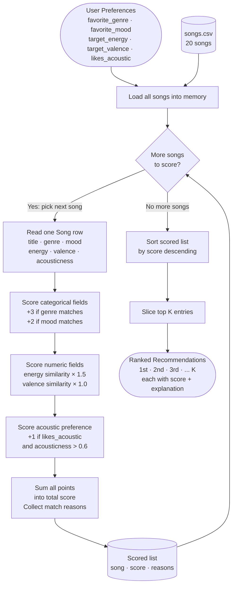

# 🎵 Music Recommender Simulation

## Project Summary

In this project you will build and explain a small music recommender system.

Your goal is to:

- Represent songs and a user "taste profile" as data
- Design a scoring rule that turns that data into recommendations
- Evaluate what your system gets right and wrong
- Reflect on how this mirrors real world AI recommenders

Replace this paragraph with your own summary of what your version does.

---

## How The System Works

Explain your design in plain language.

Some prompts to answer:

- What features does each `Song` use in your system
  - For example: genre, mood, energy, tempo
- What information does your `UserProfile` store
- How does your `Recommender` compute a score for each song
- How do you choose which songs to recommend

You can include a simple diagram or bullet list if helpful.

The features that are being used in the system would mainly be the genre, mood, energy, acoustics, and valence. The information that UserProfile would store should be all of the relevant metadata of the attributes of songs they have listened to or preferred. This gives an object of comparison for when the system can recommend other songs by similar users or content-based. The recommender can compute the score for each song based on the similaries to all of the features of the songs mentioned. A higher prioritized feature will have a higher impact on the score. Thus, the songs recommended can be based off of this scoring system.



---

## Getting Started

### Setup

1. Create a virtual environment (optional but recommended):

   ```bash
   python -m venv .venv
   source .venv/bin/activate      # Mac or Linux
   .venv\Scripts\activate         # Windows

2. Install dependencies

```bash
pip install -r requirements.txt
```

3. Run the app:

    ```bash
    python -m src.main
    ```

    ### Running Tests

    Run the starter tests with:

    ```bash
    pytest
    ```

    You can add more tests in `tests/test_recommender.py`.

    ---

    ## Experiments You Tried

    Use this section to document the experiments you ran. For example:

    - What happened when you changed the weight on genre from 2.0 to 0.5
    - What happened when you added tempo or valence to the score
    - How did your system behave for different types of users

    ---

    ## Limitations and Risks

    Summarize some limitations of your recommender.

    Examples:

    - It only works on a tiny catalog
    - It does not understand lyrics or language
    - It might over favor one genre or mood

    You will go deeper on this in your model card.

    ---

    ## Reflection

    Read and complete `model_card.md`:

    [**Model Card**](model_card.md)

    Write 1 to 2 paragraphs here about what you learned:

    - about how recommenders turn data into predictions
    - about where bias or unfairness could show up in systems like this


    ---

    ## 7. `model_card_template.md`

    Combines reflection and model card framing from the Module 3 guidance. :contentReference[oaicite:2]{index=2}  

    ```markdown
    # 🎧 Model Card - Music Recommender Simulation

    ## 1. Model Name

    Give your recommender a name, for example:

    > Songify 1.0

    ---

    ## 2. Intended Use

    - What is this system trying to do
    - Who is it for

    Example:

    > This model suggests 3 to 5 songs from a small catalog based on a user's preferred genre, mood, and energy level. It is for classroom exploration only, not for real users.
    
    This recommender is a basic simulation that suggests songs from a small dataset (of about 20) based on a user's preferences for genre, mood, energy level, and a couple of other attributes. It assumes the user already knows what they like and scores each song based on the matches and similarities.

    ---

    ## 3. How It Works (Short Explanation)

    Describe your scoring logic in plain language.

    - What features of each song does it consider
    - What information about the user does it use
    - How does it turn those into a number

    Try to avoid code in this section, treat it like an explanation to a non programmer.

    Each song is scored by comparing it against the attributes of the user's profile. A match of genre adds 3 points, a mood match adds 2, and a numeric features like energy and valence add up to 2.5 more points based on how close these numerical values are. Likewise, an acoustic metric is calculated too. Once every song has a score, the system sorts them from the highest to lowest and returns the top 5.

    ---

    ## 4. Data

    Describe your dataset.

    - How many songs are in `data/songs.csv`
    - Did you add or remove any songs
    - What kinds of genres or moods are represented
    - Whose taste does this data mostly reflect

    The dataset consists of 20 songs spanning 17 different genres, with a variety of attributes of the headers mentioned. No songs were removed from the starter set, just added with the help of Claude Code. However, it is observerd during testing that the dataset is skewed towards lower-energy songs, leaving a few options of listeners that want higher-energy level songs.

    ---

    ## 5. Strengths

    Where does your recommender work well

    You can think about:
    - Situations where the top results "felt right"
    - Particular user profiles it served well
    - Simplicity or transparency benefits

    The system works best when the user's preferences are internally consistent. This is when all of the attributes of a user's profile all point to the same type of song. Additionally, the numerical scoring logic of the valence and energy level is a good backbone of the recommender in case the genre or mood does not match. The system can still find songs that feel similar based on these attributes.

    ---

    ## 6. Limitations and Bias

    Where does your recommender struggle

    Some prompts:
    - Does it ignore some genres or moods
    - Does it treat all users as if they have the same taste shape
    - Is it biased toward high energy or one genre by default
    - How could this be unfair if used in a real product

    The dataset only conly consists of about 2/20 songs that have an energy level between 0.5-0.7. Thus, this will produce lopsided results even when the scoring logic is fair. A user who wants a moderately energetic song will be recommended by something that has a lower energy level just because of how skewed the dataset is. Additionally, the genre weight is quite heavy compared to every else. Once a genre is matched, the system is most likely to proceed with a higher score for that song.

    ---

    ## 7. Evaluation

    How did you check your system

    Examples:
    - You tried multiple user profiles and wrote down whether the results matched your expectations
    - You compared your simulation to what a real app like Spotify or YouTube tends to recommend
    - You wrote tests for your scoring logic

    You do not need a numeric metric, but if you used one, explain what it measures.

    The user profiles we tested were: High-Energy Sad, Chill Lo-Fi, Deep Intense Rock, Angry Acoustic, and Ghost Genre. For the recommended songs, I mostly looked for the reasons why the results were recommended, which all made sense according to the type of user profile. It is quite subjective per user and the type of songs they like because I was surprised to see a mix of upbeat and sad songs for the High-Energy Sad profile. This goes the same for the other profiles too, perhaps this recommender would fair better with a larger variety dataset of songs.

    ---

    ## 8. Future Work

    If you had more time, how would you improve this recommender

    Examples:

    - Add support for multiple users and "group vibe" recommendations
    - Balance diversity of songs instead of always picking the closest match
    - Use more features, like tempo ranges or lyric themes

    The most impactful future work is to add a much larger dataset of songs. Additionally, it would be best to not use genre and mood because there are so many types and subcategories. Instead, a single metric that groups all of these together like "melancholic" or "sad" or "classical" would be most appropriate. This should vastly improve the recommender to handle larger catalog of songs.

    ---

    ## 9. Personal Reflection

    A few sentences about what you learned:

    - What surprised you about how your system behaved
    - How did building this change how you think about real music recommenders
    - Where do you think human judgment still matters, even if the model seems "smart"

    Building this system made it clear to me that the saying "garbage in garbage out" is definitely true when it comes to user IO. The recommender can only be as good as the dataset, despite no machine learning. Straitforward arithmetic calculations is still a strong and simple way for content-based filtering to work. This did not change how I think about music recommendation apps because this is mostly the algorithm and core logic of how recommendations system should work.

    ```
```
## DEMO OUTPUT
```
========================================
  Top 5 Recommendations
========================================

#1  Sunrise City by Neon Echo
    Score : 6.47 / 9.50
    Genre : pop  |  Mood: happy
    Why   : genre match (+3.0), mood match (+2.0), energy similarity (+1.47)

#2  Gym Hero by Max Pulse
    Score : 4.30 / 9.50
    Genre : pop  |  Mood: intense
    Why   : genre match (+3.0), energy similarity (+1.30)

#3  Rooftop Lights by Indigo Parade
    Score : 3.44 / 9.50
    Genre : indie pop  |  Mood: happy
    Why   : mood match (+2.0), energy similarity (+1.44)

#4  Crown Moves by Street Cipher
    Score : 1.47 / 9.50
    Genre : hip-hop  |  Mood: confident
    Why   : energy similarity (+1.47)

#5  Night Drive Loop by Neon Echo
    Score : 1.42 / 9.50
    Genre : synthwave  |  Mood: moody
    Why   : energy similarity (+1.42)

========================================
```

## RESULTS FOR SYSTEM EVALUATION
```
============================================================
  1. High-Energy Sad
============================================================
  Prefs : {'genre': 'pop', 'mood': 'sad', 'energy': 0.9}
  Why   : energy=0.9 conflicts with mood='sad'. Only 1 sad song exists (Empty Hallways, energy=0.45). Does the +2.0 mood bonus beat high-energy songs that score better on proximity?

  #1  Gym Hero  —  Max Pulse
       genre=pop            mood=intense      energy=0.93
       score=4.46   genre match (+3.0), energy similarity (+1.46)
  #2  Sunrise City  —  Neon Echo
       genre=pop            mood=happy        energy=0.82
       score=4.38   genre match (+3.0), energy similarity (+1.38)
  #3  Empty Hallways  —  Vera Lane
       genre=soul           mood=sad          energy=0.45
       score=2.83   mood match (+2.0), energy similarity (+0.83)
  #4  Storm Runner  —  Voltline
       genre=rock           mood=intense      energy=0.91
       score=1.48   energy similarity (+1.48)
  #5  Static Collapse  —  Neural Drift
       genre=drum and bass  mood=anxious      energy=0.88
       score=1.47   energy similarity (+1.47)

============================================================
  2. Chill Lo-fi (baseline)
============================================================
  Prefs : {'genre': 'lofi', 'mood': 'chill', 'energy': 0.35, 'valence': 0.58}
  Why   : Fully aligned profile — genre, mood, and energy all point toward the same songs. Used as a control to compare against the adversarial cases.

  #1  Library Rain  —  Paper Lanterns
       genre=lofi           mood=chill        energy=0.35
       score=7.48   genre match (+3.0), mood match (+2.0), energy similarity (+1.50), valence similarity (+0.98)
  #2  Midnight Coding  —  LoRoom
       genre=lofi           mood=chill        energy=0.42
       score=7.38   genre match (+3.0), mood match (+2.0), energy similarity (+1.40), valence similarity (+0.98)
  #3  Focus Flow  —  LoRoom
       genre=lofi           mood=focused      energy=0.40
       score=5.42   genre match (+3.0), energy similarity (+1.42), valence similarity (+0.99)
  #4  Spacewalk Thoughts  —  Orbit Bloom
       genre=ambient        mood=chill        energy=0.28
       score=4.33   mood match (+2.0), energy similarity (+1.40), valence similarity (+0.93)
  #5  Coffee Shop Stories  —  Slow Stereo
       genre=jazz           mood=relaxed      energy=0.37
       score=2.34   energy similarity (+1.47), valence similarity (+0.87)

============================================================
  3. Deep Intense Rock
============================================================
  Prefs : {'genre': 'rock', 'mood': 'intense', 'energy': 0.95}
  Why   : Only 1 rock song exists in the catalog (Storm Runner). Reveals what fills ranks 2-5 when the niche is exhausted.

  #1  Storm Runner  —  Voltline
       genre=rock           mood=intense      energy=0.91
       score=6.44   genre match (+3.0), mood match (+2.0), energy similarity (+1.44)
  #2  Gym Hero  —  Max Pulse
       genre=pop            mood=intense      energy=0.93
       score=3.47   mood match (+2.0), energy similarity (+1.47)
  #3  Pulse Override  —  Digital Surge
       genre=edm            mood=energetic    energy=0.95
       score=1.50   energy similarity (+1.50)
  #4  Iron Descent  —  Fracture Point
       genre=metal          mood=angry        energy=0.97
       score=1.47   energy similarity (+1.47)
  #5  Static Collapse  —  Neural Drift
       genre=drum and bass  mood=anxious      energy=0.88
       score=1.40   energy similarity (+1.40)

============================================================
  4. Angry Acoustic Contradiction
============================================================
  Prefs : {'genre': 'folk', 'mood': 'angry', 'energy': 0.85, 'likes_acoustic': True}
  Why   : mood='angry' + likes_acoustic=True. The only angry song (Iron Descent, metal) has acousticness=0.03 — it CANNOT earn the +1.0 acoustic bonus. Acoustic songs are all peaceful/chill and never match the mood.

  #1  Fading Lamplight  —  The Wren Sisters
       genre=folk           mood=melancholic  energy=0.30
       score=4.67   genre match (+3.0), energy similarity (+0.67), acoustic feel (+1.0)
  #2  Iron Descent  —  Fracture Point
       genre=metal          mood=angry        energy=0.97
       score=3.32   mood match (+2.0), energy similarity (+1.32)
  #3  Dust Road Memories  —  Hank Hollow
       genre=country        mood=nostalgic    energy=0.48
       score=1.95   energy similarity (+0.95), acoustic feel (+1.0)
  #4  Empty Hallways  —  Vera Lane
       genre=soul           mood=sad          energy=0.45
       score=1.90   energy similarity (+0.90), acoustic feel (+1.0)
  #5  Midnight Coding  —  LoRoom
       genre=lofi           mood=chill        energy=0.42
       score=1.85   energy similarity (+0.86), acoustic feel (+1.0)

============================================================
  5. Ghost Genre (latin)
============================================================
  Prefs : {'genre': 'latin', 'mood': 'happy', 'energy': 0.8, 'valence': 0.9}
  Why   : genre='latin' matches zero songs. The +3.0 genre bonus never fires, so ranking falls back entirely on mood, energy, and valence proximity.

  #1  Sunrise City  —  Neon Echo
       genre=pop            mood=happy        energy=0.82
       score=4.41   mood match (+2.0), energy similarity (+1.47), valence similarity (+0.94)
  #2  Rooftop Lights  —  Indigo Parade
       genre=indie pop      mood=happy        energy=0.76
       score=4.35   mood match (+2.0), energy similarity (+1.44), valence similarity (+0.91)
  #3  Crown Moves  —  Street Cipher
       genre=hip-hop        mood=confident    energy=0.78
       score=2.29   energy similarity (+1.47), valence similarity (+0.82)
  #4  Pulse Override  —  Digital Surge
       genre=edm            mood=energetic    energy=0.95
       score=2.18   energy similarity (+1.28), valence similarity (+0.90)
  #5  Gym Hero  —  Max Pulse
       genre=pop            mood=intense      energy=0.93
       score=2.17   energy similarity (+1.30), valence similarity (+0.87)

============================================================
  Evaluation complete.
============================================================
```